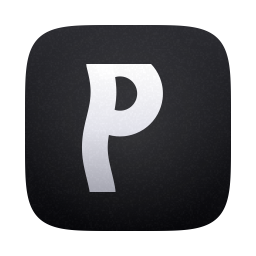
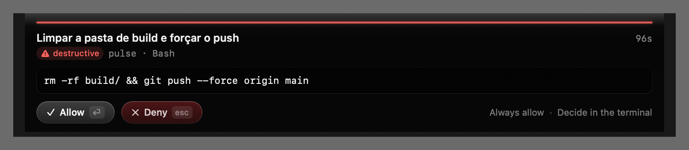
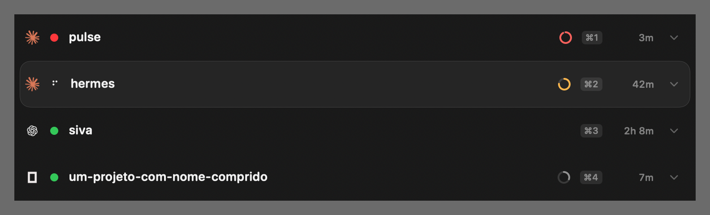
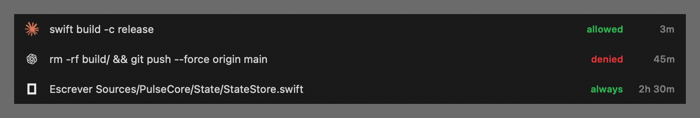

<p align="center">
  
</p>

<h1 align="center">Pulse</h1>

<p align="center">
  <strong>Your coding agents, watched from the notch.</strong><br/>
  Approve permissions, track context, and jump to the right terminal pane — without leaving your editor.
</p>

<p align="center">
  
  
  
  
</p>

---

Run Claude Code, Codex, OpenCode, Pi or Convoy in parallel and the notch
becomes your mission control: who's working, who needs you, how much context
each session has left — and when an agent asks to run a command, you answer
right there.

<p align="center"></p>

## Why Pulse

**Answer permission requests without switching windows.** The agent's request
appears in the notch with the command rendered for what it is — a diff shows
as a diff, arguments as fields, never raw JSON — plus a risk signal
(read-only / modifies / destructive), a copy button for the third path
between allow and deny, and a burning-fuse deadline. If you're already
looking at that terminal pane, the card stays out of your way and the
agent's own prompt takes over.

<p align="center"></p>

**See trouble before it happens.** Each session row carries a context gauge
read from the agent's real transcript — white, amber at 70%, red at 90%. An
agent about to compact is an agent you brief differently. The header shows
your five-hour plan burn (real tokens and responses, no invented
percentages), and rows show live subagent counts by exact
`tool_use`/`tool_result` pairing.

<p align="center"></p>

**Never lose an answer.** Every allow and deny lands in an append-only local
log, one click away.

<p align="center"></p>

**Drive it from the keyboard.** `⌥⌘A` opens the panel from any app with key
focus ready: arrows move, `⏎` jumps to that session's terminal, `esc`
closes, `⌘1–9` jump directly, `H` flips to history. Jumping lands on the
*exact* pane — including the right tab and split inside
[cmux](https://cmux.dev), via the surface ids its environment exports.

**Watch agents on remote servers.** `./scripts/pulse-remote.sh user@host`
mounts the server's Pulse state over SSHFS with auto-reconnect and registers
it. Remote sessions show up with a `remote` badge, and approving a remote
permission request writes the reply into the mounted directory — the same
file protocol, across the wire. Requires Pulse hooks installed on the server.

**Hear it, in Portuguese.** Optional per-tool voices with signature chimes,
silent during Do Not Disturb, calls, and whenever you're already looking at
that terminal.

## Engineering you can check

Claims here are measured, not vibes — the tooling ships in the repo:

- **The app portraits itself.** `kill -USR2 $(pgrep -x Pulse)` renders every
  view to PNG with no screen attached (built when the UI had to be audited on
  a locked Mac).
- **Contrast is a tool, not an opinion.** `python3 scripts/audit-contrast.py`
  finds the text bands in those portraits and fails below WCAG AA 4.5:1.
- **Energy is budgeted.** ~4.8% CPU with the bar animating (down from
  10.8%), zero animation while the screen is locked or asleep, audio engine
  shut down between chimes. 73 MB RAM.
- **Accessibility is complete.** Reduce Transparency, Differentiate Without
  Color, Increased Contrast and VoiceOver all honored — including in the
  private Liquid Glass path the system doesn't cover for you.
- **185 tests**, including the decision channel, the transcript meters and
  the layout math.

## Install

Requires macOS 26+ and the Xcode Command Line Tools (no Xcode needed).

```bash
git clone https://github.com/nunonamora/pulse
cd pulse
./scripts/install.sh
```

Builds, installs to `/Applications`, wires the agent hooks, launches, and
verifies itself (`pulse doctor`). Re-run the same script to update.

## How it works — and what it never does

Pulse listens to the hooks your agents already expose (Claude Code hooks,
OpenCode plugin, Pi extension). State lives in `~/.pulse/` as plain JSON.
Permission decisions travel over two files with atomic renames — the hook
blocks politely and releases itself after 150 s if you never answer.

Everything is local. No network calls, no telemetry, no reading your code,
no API keys. The transcript meters read files Claude Code already writes on
your disk, tail-only.

## Keyboard reference

| Key | Action |
|---|---|
| `⌥⌘A` | Toggle the panel from anywhere |
| `↑ ↓` | Move selection |
| `⏎` | Jump to that session's terminal pane |
| `⌘1–9` | Jump directly |
| `H` | Toggle decision history |
| `esc` | Close |
| `⏎` / `esc` on a request | Allow / Deny |

## Credits

Pulse is a fork of [AgentGlance](https://github.com/Inakitajes/AgentGlance)
by Josemi Hernandez (MIT) — the session engine, the notch panel and the
Liquid Glass backdrop started there, and that craftsmanship made everything
above possible. The original README is preserved in
`README-agentglance-original.md`; a Portuguese deep-dive lives in
`docs/README.pt.md`.

## License

MIT. Upstream copyright notice preserved in `LICENSE`.
